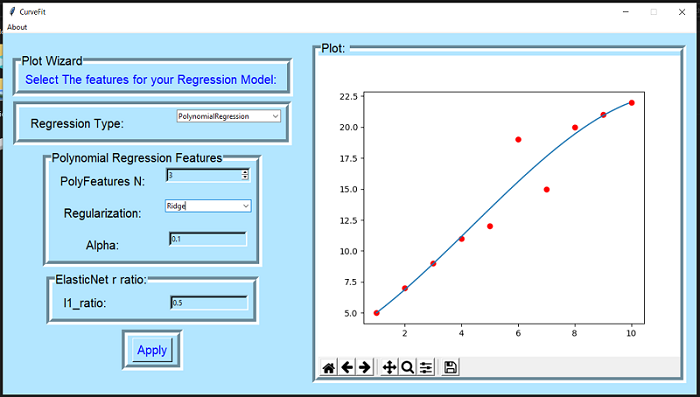

# CurveFit-Regression-Based-Tool
CurveFit is a GUI tool created using Tkinter Module of Python. It uses Linear Regression , Polynomial Features and other Machine Learning Algorithms. It uses scikit-learn's linear_model library for the implementations of Linear Regression , SGD Ridge Lasso and ElasticNet Algorithms. CurveFit Tool outputs the live Matplotlib Plot for the diffrent values of Hyperparameters set by user through GUI interface. Matplolib with Tkinter as a backend , is used to Embedd Plots directly in the Tkinter Frame. User can input the induvidual data items Manually through the GUI interface or a .csv file can also be provided which is automatically preprocessed into numpy arrays using pandas and numpy , and scaled properly by StandardScalar class by scikit-learn for Regression Classes.

## Design Style
The Complete Design of GUI consist of Five Windows and code for each of these is stored in root<window code>.py named Files.
These Five Windows are Interconnected through inter root link and the Initil point for code is provided in main.py file.
The Function of These Five Windows is as follow:
  
**1. root1 :** It is the Main Opening Window Appearing Initially.

**2. root2 :** It Presents the option of Manual Data Input for User.

**3. root2b :**: It Presents option of importing Data in form of an .csv File

**4. root3 :** It allows User to Input Labels for the Plot.

**5. root4 :** It consist of Parameters for Regression and an Matplotlib Plot Embedded In Frame. User can Change the parameters and 
observe the effect on Plot on the Same Window.

## Regression Models:
The Regression models used for the project are based on Linear Regression implementation of scikit-learn's linear_model library.The Models used are:

**1. Linear Regression:** It is Basic Regression Model Implemented Using Normal Equations of Linear Regression.

**2. Polynomial Regression:** It is Implemented by converting Feature Matrix to Poly Feature Matrix using scikit-learn PolyFeatures class, Then Linear Regression is used to fit the Model.

**3. Ridge Regression:** It is Implementation of Ridge Reglarization on Linear Regression Model and it uses Stochastic Gradient Decent Algorithm to fit the Model. It can be tuned by parameter Alpha to prevent underfitting on Data.

**4. Lasso Regression:** It is Implementation of Lasso Reglarization on Linear Regression Model and it uses Stochastic Gradient Decent Algorithm to fit the Model. It can be tuned by parameter Alpha to prevent Overfitting on Data.

**5. ElasticNet Regression:** It implements Ridge and Lasso Regularization and their weights can be decide using l1_ratio hyperparameter.

## Sample Screenshot

